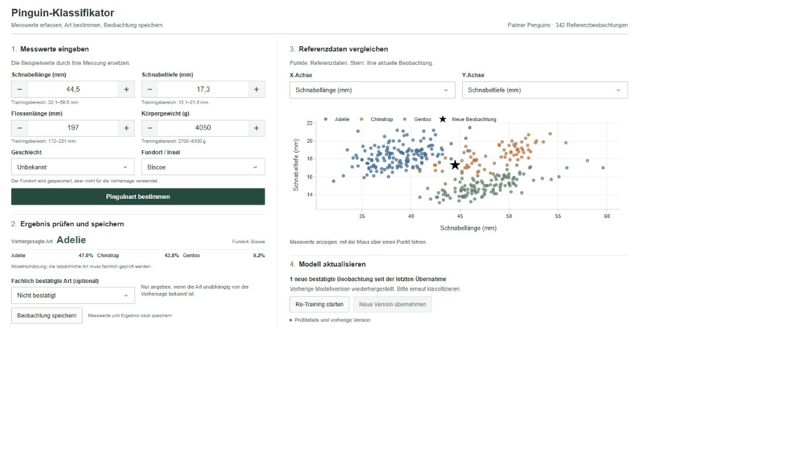

# Penguin Classifier

Lokale Webanwendung zur Bestimmung der Pinguinarten **Adelie**, **Chinstrap** und
**Gentoo** anhand von Schnabelmaßen, Flossenlänge, Körpergewicht und Geschlecht.
Sie wurde im Kurs **Machine Learning Systems Design** entwickelt und ermöglicht
das Erfassen, Klassifizieren und Speichern von Beobachtungen ohne Python-Kenntnisse.



## Einrichten und starten

Docker bündelt Anwendung, Python, Paketabhängigkeiten, Referenzdaten und Modell.
Für diesen Startweg ist keine lokale Python-Installation erforderlich.

1. Den vollständigen Projektordner herunterladen oder klonen.
2. Unter Windows/macOS Docker Desktop mit Linux-Containern, unter Linux Docker
   Engine mit Compose v2 installieren und starten. Compose muss `up --wait`
   unterstützen.
3. Für die erste Einrichtung mit Internetverbindung die passende Datei ausführen:

| System | Einmalig einrichten | Später starten | Beenden |
| --- | --- | --- | --- |
| Windows | Doppelklick auf `setup.bat` | Doppelklick auf `start.bat` | Doppelklick auf `stop.bat` |
| macOS | Doppelklick auf `setup.command` | Doppelklick auf `start.command` | Doppelklick auf `stop.command` |
| Linux | `sh setup.sh` | `sh start.sh` | `sh stop.sh` |

Unter macOS die Dateien vor der ersten Ausführung im Terminal ausführbar machen:

```bash
chmod +x setup.command start.command stop.command
```

Terminalbefehle werden im Projektordner ausgeführt. Unter Linux kann alternativ
je eine Desktop-Verknüpfung `sh` mit dem vollständigen Pfad zur Startdatei aufrufen.

`setup` baut das Image und öffnet nach der Bereitschaftsprüfung den Browser.
Der erste Aufbau kann mehrere Minuten dauern. Die Anwendung ist lokal unter
[http://127.0.0.1:8050](http://127.0.0.1:8050) erreichbar; die Adresse lässt sich
auch von Hand öffnen, falls kein Browserfenster erscheint.

Für spätere Starts muss Docker bereit sein. `start` nutzt das vorhandene Image
ohne Neubau oder Download. Nach Programmänderungen `setup` erneut ausführen.
Das Schließen des Browsers beendet die Anwendung nicht; dafür `stop` verwenden.
Bei belegtem Port 8050 zunächst eine bereits laufende Instanz beenden.

Ein anderer Port, Starteroptionen, Bind-Mounts und der alternative
[Start mit Python 3.12](docs/Technische_Dokumentation.md#lokaler-start-mit-python)
sind in der technischen Dokumentation beschrieben.

## Beobachtungen erfassen

1. Beispielwerte durch eigene Messungen ersetzen. Geschlecht und Insel auswählen;
   unbekanntes Geschlecht ist zulässig. Die Insel wird als Kontext gespeichert
   und geht nicht in das Klassifikationsmodell ein.
2. **Pinguinart bestimmen** anklicken. Art, Modellwahrscheinlichkeiten und
   Warnungen prüfen. Der schwarze Stern im Diagramm markiert die neue Beobachtung;
   die Achsen können über die Auswahlfelder geändert werden.
   Das Merkmal der anderen Achse ist im Auswahlfeld ausgegraut und nicht wählbar.
   Nach einem Achsenwechsel wird die Sperre entsprechend aktualisiert.
3. Nur wenn die tatsächliche Art unabhängig von der Modellvorhersage fachlich
   bekannt ist, **Fachlich bestätigte Art (optional)** auswählen. Andernfalls
   **Nicht bestätigt** belassen.
4. **Beobachtung speichern** anklicken. Die CSV enthält Messwerte, Vorhersage und
   gegebenenfalls die ausdrücklich bestätigte Art in `validated_species`.

Eine geänderte Eingabe verwirft die bisherige Vorhersage. Die Artbestätigung wird
bei Eingabeänderungen und jeder neuen Klassifikation zurückgesetzt. Gespeicherte
Ergebnisse lassen sich durch erneutes Klicken nicht doppelt speichern.
Die Modellvorhersage wird niemals automatisch zum bestätigten Trainingslabel.

## Modell aktualisieren

Neue Beobachtungen lösen kein automatisches Training aus. Im Bereich
**Modell aktualisieren** lässt sich mit neuen oder geänderten, fachlich bestätigten
Beobachtungen manuell **Re-Training starten**. Die Anwendung prüft die Daten und
zeigt anschließend den Vergleich von Accuracy, Macro-F1 und Cohen's Kappa.

Das aktive Modell bleibt während des Trainings verfügbar. Erst
**Neue Version übernehmen** aktiviert den Kandidaten. Bei Bedarf führt
**Vorherige Version wiederherstellen** zur vorherigen Version zurück.
Die Entscheidung über Labels und Modellübernahme liegt bei der bedienenden Person.
Details zu Datenprüfung, Bewertung und Versionen stehen im
[Re-Training-Ablauf](docs/Technische_Dokumentation.md#manuelles-re-training-und-modellvergleich).

## Daten und Grenzen

- Die Grundlage sind 342 nutzbare Beobachtungen des Palmer-Penguins-Datensatzes.
  Fehlende morphologische Messwerte werden ausgeschlossen, unbekanntes Geschlecht
  wird in der Modellpipeline behandelt.
- Klassenwahrscheinlichkeiten sind Modellschätzungen. Gute Ergebnisse auf dem
  kleinen Referenzdatensatz garantieren keine gleiche Genauigkeit bei neuen
  Expeditionen. Warnungen kennzeichnen Messwerte außerhalb des Trainingsbereichs.
- Neue Trainingsläufe verwenden einen Random Forest mit 500 Bäumen und
  `max_depth=5`. Das mitgelieferte Basismodell hat `max_depth=None`;
  gespeicherte Modelle ändern sich durch ein Code-Update nicht.
- Docker speichert Beobachtungen und Modellversionen dauerhaft in den Volumes
  `penguin-data` und `penguin-models`, getrennt von den lokalen Projektordnern.
  `stop` erhält diese Daten; ein neues Image ersetzt sie nicht. Für Sicherungen
  werden beide Volumes benötigt. Details unter
  [persistente Speicherung](docs/Technische_Dokumentation.md#persistente-speicherung).
- Die Anwendung ist für den lokalen Einzelbetrieb vorgesehen. Es gibt keine
  Nutzerrollen; mehrere Instanzen dürfen nicht dieselben Datenordner verwenden.

## Prüfstand und weitere Dokumentation

Der letzte dokumentierte vollständige Lauf umfasst **164 bestandene Tests** unter
Windows mit Git Bash. Am **03.10.2026** bestanden nach der Anpassung der
Zahlenformatierung zusätzlich die **52 Tests** für Anwendung, Modellservice und
Speicherung; dies war kein erneuter vollständiger Testlauf.
Starttests mit simulierter Docker-CLI ersetzen keine Prüfung auf einem echten
Zielsystem.

Der echte Container-Funktionstest vom **27.09.2026** bestand für das damalige
Image einschließlich Speicherung, Re-Training, Modellwechsel und Persistenz.
Nach den späteren Änderungen an Oberfläche und Modellkonfiguration stehen
Neubau und erneute Containerprüfung aus. Ein Test mit tatsächlich getrenntem
Netzwerk sowie native Linux- und macOS-Tests stehen ebenfalls aus.
Vorhersage, Speicherung und Re-Training sind für den lokalen Offlinebetrieb ausgelegt.

- [Technische Dokumentation](docs/Technische_Dokumentation.md): Modell, Kennzahlen,
  Projektstruktur, Entwicklungsstart, Tests und vollständige Betriebsdetails.
- [Docker-Prüfprotokoll](docs/Docker_Pruefprotokoll.md): durchgeführte und offene
  Prüfungen; getrennter Funktionstest über `docker-pruefen.bat`.
- [Modellstudie](docs/modellpruefung/bericht.md) und
  [Vergleich mit logistischer Regression](docs/modellpruefung/einfaches_modell.md).
- [Konzeptionsphase](docs/Konzeptionsphase_Text.md) und
  [Erarbeitungsphase](docs/Erarbeitungsphase_Text.md).
